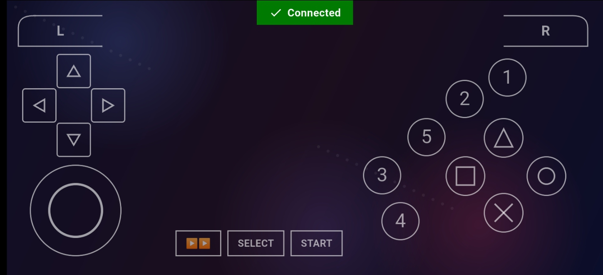
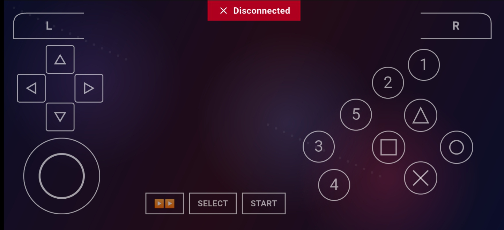

# Gamepad App (Flutter)

A Flutter mobile app that turns your phone into a wireless gamepad. It renders
a custom, PSP/PPSSPP-inspired controller UI and streams input state to an
ESP32/STM32 board over UDP.

This directory is the **app** half of the [esp32-gamepad-controller](../)
project. For the firmware side, see [`../firmware`](../firmware). For the
full wire protocol spec, see [`../docs/PROTOCOL.md`](../docs/PROTOCOL.md).

## Features

- Analog joystick — outputs normalized `-1.0..1.0`, snaps back to center on release
- Independent 4-way D-pad
- PSP-style action button diamond (Cross / Circle / Square / Triangle)
- 5 extra configurable buttons for special moves / utility actions
- L / R shoulder buttons
- Start, Select, and Pause controls
- Fully custom-painted widgets — no external icon assets
- Animated background with high-contrast foreground controls
- Real-time UDP streaming to a microcontroller on every input change

## Project structure

```
lib/
├── main.dart                      # App entry point, orientation lock, MaterialApp
├── models/
│   └── btn_constants.dart         # Bit-mask constants for every button (Btn class)
├── screens/
│   └── controller_screen.dart     # Main controller layout, UDP socket, input state
└── widgets/
    ├── action_button.dart         # Diamond action buttons (Cross/Circle/Square/Triangle)
    ├── animated_background.dart   # Drifting gradient + grid background
    ├── dpad.dart                  # 4-directional D-pad
    ├── joystick.dart              # Analog stick
    ├── number_button.dart         # Numbered utility buttons (1-5)
    ├── pill_button.dart           # Start / Select buttons
    └── shoulder_button.dart       # L / R trapezoid shoulder buttons
```

## Requirements

- Flutter SDK (stable channel)
- A physical Android/iOS device (UDP socket + orientation lock behave best on
  real hardware, not simulators)
- An ESP32 (or STM32 running the companion firmware) broadcasting a Wi-Fi
  access point

## Getting started

```bash
cd app
flutter pub get
flutter run
```

### Point the app at your board

Open `lib/screens/controller_screen.dart` and update the connection constants
to match your board's SoftAP:

```dart
static const String espIp = '192.168.4.1';
static const int espPort = 4210;
```

Then:
1. Flash and power on the ESP32/STM32 (see `../firmware`)
2. Connect your phone to the board's Wi-Fi access point
3. Launch the app — it binds a local UDP socket and starts sending on input

## How input is sent

Every button press/release or joystick movement sends an 8-byte UDP packet:

| Byte | Meaning |
|------|---------|
| 0 | `0xAA` frame start marker |
| 1–4 | 32-bit button bitmask (little-endian) |
| 5 | Joystick X (0–255, 128 = center) |
| 6 | Joystick Y (0–255, 128 = center) |
| 7 | XOR checksum of bytes 0–6 |

Button bit assignments live in `lib/models/btn_constants.dart`. Full details
in [`../docs/PROTOCOL.md`](../docs/PROTOCOL.md).

## Known limitations / TODO

- Layout assumes landscape orientation; add a portrait "rotate device" fallback
- IP/port are hardcoded — consider a settings screen or Wi-Fi discovery
- No reconnect/retry logic if the UDP socket fails to bind

## License

MIT (or match the root repo license)




